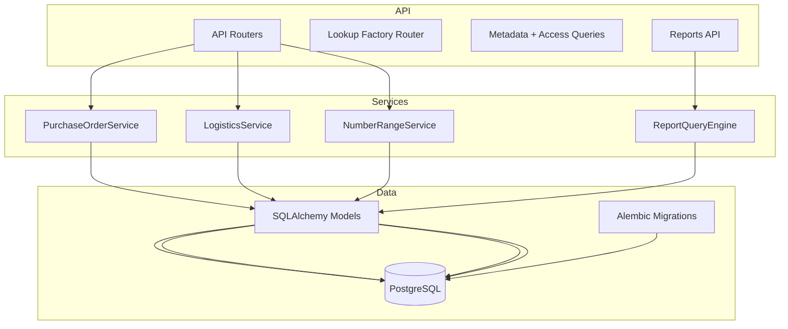

# Architecture

This backend is a layered FastAPI service with SQLAlchemy models, service classes for domain workflows, and a dynamic reporting engine.

## High-level component layout

## Runtime entrypoint

- `app/main.py` creates the FastAPI app, applies CORS middleware, and includes routers.
- Core routers are registered directly (users, roles, metadata, access queries, number ranges).
- Domain APIs are grouped in `app/api/v1/endpoints/api.py` under `/api/v1`.

## Configuration

- `app/core/config.py` loads `DATABASE_URL` from env with a default fallback.
- `app/db/session.py` creates the SQLAlchemy engine and `SessionLocal`.
- `check_env.py` prints the resolved database URL.

## API layers

### CRUD routers (direct)

Located in `app/api/routers` and follow a REST pattern:
- `users`, `roles`, `permissions`, `role_permissions`
- `user_roles`, `user_departments`, `user_countries`, `user_attributes`
- `domains`, `object_types`, `masteraddr`, `forwarders`
- `number_range` (sys number ranges)
- `metadata` (table metadata for UI)
- `user_profile`, `access_queries` (joined profile + RBAC queries)

### Lookup factory (dynamic routers)

`app/api/v1/endpoints/lookup_factory.py` dynamically builds CRUD routers for lookup tables.
Configured in `app/api/v1/endpoints/api.py` via `LOOKUP_CONFIG`.

### Domain endpoints

Under `/api/v1`:
- `/purchase-orders` (PO creation and retrieval)
- `/shipments` (shipment execution and retrieval)
- `/reports/visibility` (report metadata, data, and Excel export)

## Services

### PurchaseOrderService

File: `app/services/purchase_order_service.py`

Responsibilities:
- Validate vendor existence and activity
- Recompute line totals and header totals server-side
- Assign initial status and persist header/items
- Retrieve PO with joined lookup relationships

### LogisticsService

File: `app/services/logistics_service.py`

Responsibilities:
- Create shipment header and items
- Lock PO items (row-level) to prevent overship
- Validate remaining quantity
- Update PO item status when fully shipped

### NumberRangeService

File: `app/services/number_range_get.py`

Responsibilities:
- Create and update range configurations
- Generate next number using row-level lock
- List and delete ranges

### ReportQueryEngine

File: `app/core/reports/query_engine.py`

Responsibilities:
- Build dynamic queries based on config
- Apply joins, projection, filters, and sorting
- Provide consistent behavior for data and export

## Cross-cutting patterns

- SQLAlchemy sessions are per-request via `Depends(get_db)`
- Errors are surfaced as HTTP errors at router level
- Soft delete exists for `users` via `?mode=soft` (sets `is_active=false`)
- Dynamic UIs consume `/metadata/{table}` and use type info for forms/tables
