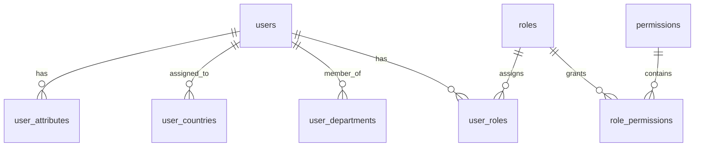
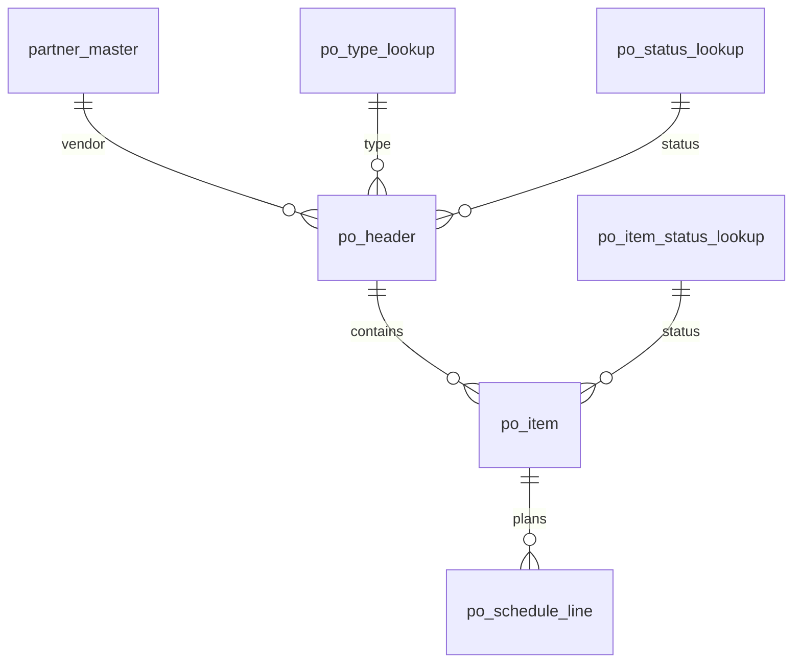
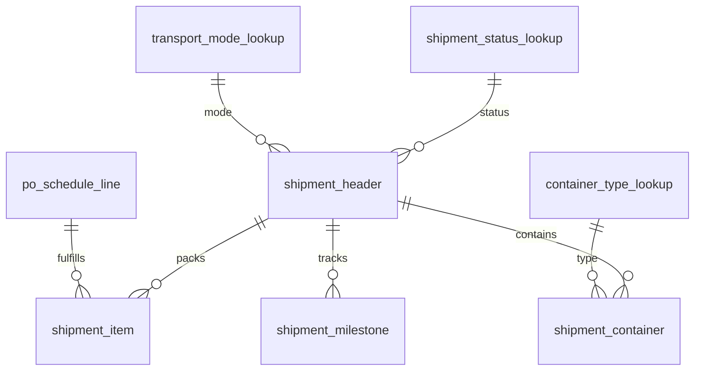

# Data Model

This section summarizes the SQLAlchemy models and their logical groupings.
Table names are shown in brackets.

## RBAC and users

- User [users]: id, username, email, clearance, is_active, created_at
- Role [roles]: id, name
- Permission [permissions]: id, action_key, object_type
- UserRole [user_roles]: id, user_id, role_id
- RolePermission [role_permissions]: id, role_id, permission_id, role_name
- UserDepartment [user_departments]: id, user_id, department
- UserCountry [user_countries]: id, user_id, country_code
- UserAttribute [user_attributes]: id, user_id, key, value

## Master data

- MasterAddr [masteraddr]: name, addr_type, country, city, street, phone, email, validity
- PartnerRole [partner_role_lookup]: role_code, role_name
- PartnerMaster [partner_master]: partner_identifier, role_id, legal_name, payment terms, currency, addr_id
- CompanyMaster [company_master]: company_code, branch_code, legal_name, addr_id
- Forwarder [forwarder]: forwarder_id, branch_id, validity
- Domain [domains]: domain_name, technical_key, display_label, is_active
- ObjectType [object_types]: object_type, object_description
- SystemQualifier [system_qualifier]: category, code, label, description

## Product and pricing

- ProductMaster [product_master]: sku_identifier, type_id, uom_id, hs_code, origin, weight, volume
- ProductTypeLookup [product_type_lookup]
- UomLookup [uom_lookup]
- PricingType [pricing_type_lookup]
- PricingCondition [pricing_condition]: product_id, partner_id, rate, currency, validity

## Procurement

- PurchaseOrderHeader [po_header]: po_number, type_id, status_id, purchase_org_id, vendor_id, total_amount, currency
- PurchaseOrderItem [po_item]: po_header_id, item_number, product_id, status_id, quantity, unit_price, line_total
- POScheduleLine [po_schedule_line]: po_item_id, shipment_header_id, quantity, delivery_date
- PurchaseOrderStatusLookup [po_status_lookup]
- PurchaseOrderTypeLookup [po_type_lookup]
- PurchaseOrgLookup [purchase_org_lookup]
- PurchaseOrderItemStatusLookup [po_item_status_lookup]

## Logistics

- ShipmentHeader [shipment_header]: shipment_number, status_id, mode_id, carrier_id, ETA/ETD
- ShipmentItem [shipment_item]: shipment_header_id, po_schedule_line_id, shipped_qty
- ShipmentContainer [shipment_container]: container_type_id, container_number, seal_number
- ShipmentMilestone [shipment_milestone]: milestone_id, event_datetime, location
- ShipmentStatusLookup [shipment_status_lookup]
- TransportModeLookup [transport_mode_lookup]
- MilestoneTypeLookup [milestone_type_lookup]
- ContainerTypeLookup [container_type_lookup]

## Finance and landed cost

- CostComponentLookup [cost_component_lookup]: component_code, component_name, is_tax
- LandedCostEntry [landed_cost_entry]: shipment_header_id, component_id, amount, currency

## Documents and text

- DocumentTypeLookup [document_type_lookup]
- DocumentAttachment [document_attachment]: type_id, file_path, shipment_id, po_header_id, partner_id
- TextTypeLookup [text_type_lookup]
- TextMaster [text_master]: type_id, content, PO/shipment/partner/product foreign keys

## System numbering

- SysNumberRange [sys_number_ranges]: doc_category, doc_type_id, prefix, current_value, padding, include_year, is_active

Number range generation uses row-level locking to ensure unique sequence increments.
