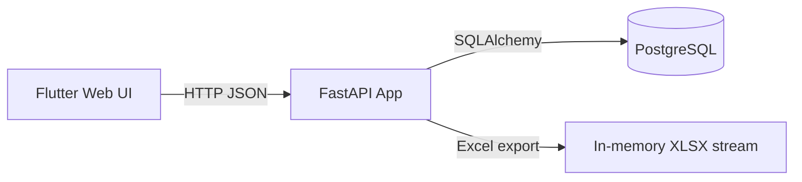

# FLUXPORT Backend Documentation

This is the developer-facing documentation for the FLUXPORT backend (FastAPI + SQLAlchemy + PostgreSQL).
It focuses on architecture, data model, API surface, and service workflows.

## Quick map

- Architecture: `architecture.md`
- API surface: `api.md`
- Data model: `data-model.md`
- Reporting engine: `reporting.md`
- Dev setup and operations: `dev-setup.md`

## At a glance

- Runtime: FastAPI + Uvicorn
- ORM: SQLAlchemy 2.x
- Migrations: Alembic
- DB: PostgreSQL (configured via `DATABASE_URL`)
- Contracts: OpenAPI in `openapi.json`, Postman collection in `collection.json`

## System context

## Folder layout (core)

- `app/main.py`: FastAPI app and router registration
- `app/api`: HTTP routers (CRUD, metadata, reports)
- `app/services`: domain services (PO, logistics, number range)
- `app/models`: SQLAlchemy models (business, lookup, and RBAC)
- `app/schemas`: Pydantic schemas
- `app/db`: DB session and base
- `app/core/reports`: report config + dynamic query engine
- `alembic/`: migrations
