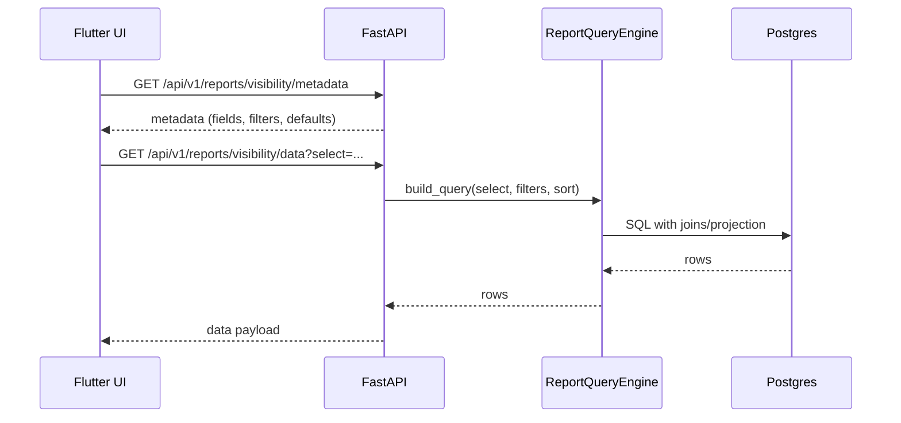

# Reporting Engine (Visibility)

The reporting system is a metadata-driven, SQLAlchemy-based query engine that powers a dynamic UI grid.

## Components

- `app/core/reports/visibility_config.py`
  - Defines `VISIBILITY_REPORT_CONFIG` with:
    - report id
    - base model
    - field definitions (path, label, group, filter_type)
    - join paths and icon formatting rules
- `app/core/reports/query_engine.py`
  - Builds queries dynamically based on selected columns, filters, and sort
  - Applies joins only when required
- `app/api/v1/endpoints/reports.py`
  - Exposes metadata, data, and export endpoints

## Request flow

## Filters and sorting

- Filters are applied per field based on `filter_type`:
  - `search` -> `ilike`
  - `select` -> `in`
  - `date_range` and `numeric_range` -> caller should map to filter keys
- Sorting uses `sort` with optional leading `-` for DESC

## Export

`GET /api/v1/reports/visibility/export`:
- Uses the same query engine for consistency
- Generates an XLSX stream in-memory and returns it as a download

## Notes for extension

- Add new columns by editing `VISIBILITY_REPORT_CONFIG["fields"]`
- Joins can use tuples `(ModelAlias, on_clause)` for disambiguation
- Any new field should include `label` and `path` at minimum
